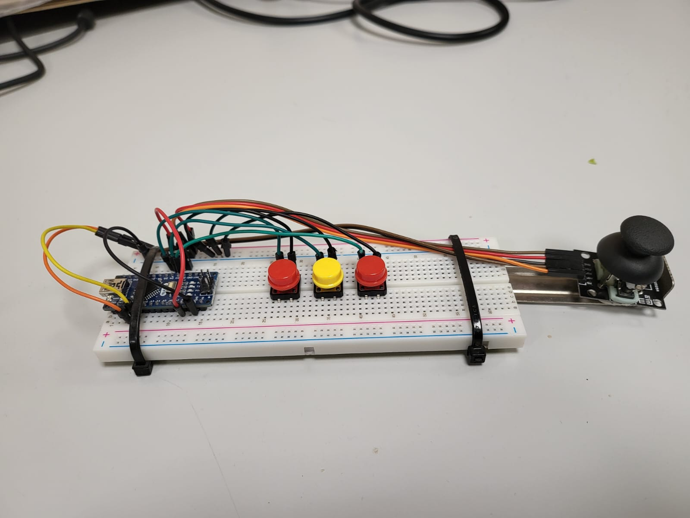

# About
This is my project for a course on systems programming. The aim of the project is to write a loadable Linux kernel module.

I decided to build a video game controller from scratch and write a driver to interact with it.

# The controller
The controller is built using an arduino nano as the controller. It contains 3 push buttons and one analogue stick. The analogue stick contains another push button.

# How it works
The arduino polls the hardware devices at regular intervals to determine their state. It compiles the state into a struct. That struct is written over the serial data line connected to the linux device.

The driver listens for any incomming data from the specific hardware device. It has an input buffer that gets populated as the data is read from the serial line. Once the complete message has been recieved over the serial line, an internal buffer is updated with the complete state of the controller. When a user space program queries the state of the controller, the internal buffer is written to user space.